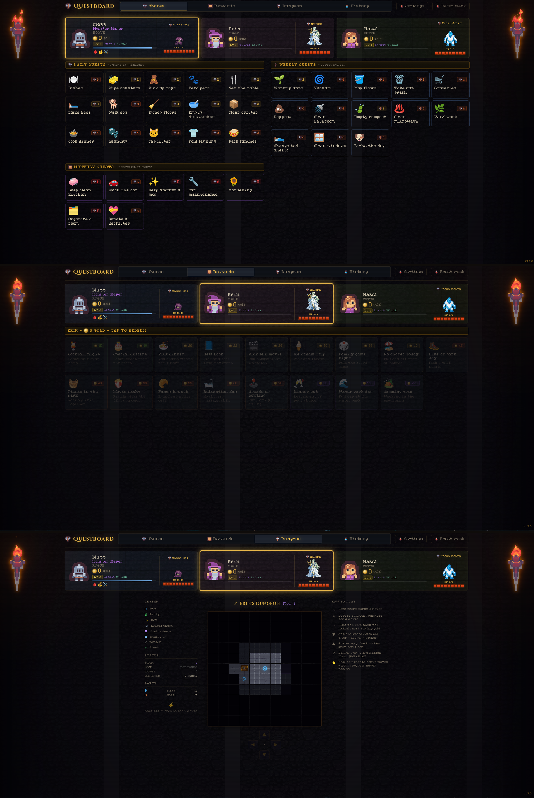

# Questboard

> Turn household chores into a pixel art RPG adventure for the whole family.

Each family member gets a hero and a daily monster to fight. Complete chores to deal damage  -  defeat the monster before midnight to earn gold, or it strikes back. Spend gold on rewards you've agreed on as a family.

Built to run on a kitchen tablet, locked to a browser, always-on.



[](https://github.com/thillygooth/questboard/releases)
[](LICENSE)
[](https://ko-fi.com/thillygooth)

---

## What it looks like

The interface runs fullscreen in the browser. Each player gets a card with their hero, live HP bar, and current monster. Completing chores hits the monster  -  chain them fast for combo damage, score a crit, or find loot drops.

**Player card**  -  hero class, gold, XP bar, crit %, streak  
**Monster section**  -  animated pixel art enemy, segmented HP bar, kill = gold reward  
**Chore grid**  -  daily / weekly / monthly quests shown with damage values  
**Dungeon map**  -  per-player fog-of-war grid; chores earn moves, rooms hide gold, traps, and mini-bosses  
**Reward shop**  -  spend gold on family rewards you configure in setup  
**History**  -  full log of kills, loot drops, rewards redeemed, badges earned

---

## Features

| Feature | Description |
|---------|-------------|
| ⚔ Monster battles | Each player fights a date-seeded monster every day |
| 💥 Crit hits | 5% base crit chance, increases as you level up |
| 🔥 Kill streaks | Multi-day streaks multiply gold rewards (up to 2×) |
| 🎯 Combo attacks | Chain chores within 8 seconds for up to 2.5× bonus |
| 🎲 Loot drops | Chance to find bonus gold or XP on any chore |
| ⚡ Overkill system | After the kill, extra chores charge a bar to bank Power Tokens |
| 🔮 Power-ups | Gold Rush, Double Damage, Shield Aura, Treasure Magnet, Forge Reward |
| 🛡 Shield Aura | Active power-up blocks the midnight gold penalty |
| 🏅 Badges & titles | Unlock achievements and choose your hero title |
| ⭐ Prestige | Reset XP at level 10 for a permanent gold % bonus |
| 🗺 Dungeon map | Explore a per-player fog-of-war dungeon  -  chores = moves |
| 🏆 Weekly leaderboard | See who earned the most gold this week |
| ⚡ Auto-resets | Daily/weekly/monthly chores reset at exactly the right time |
| 🌙 Overnight penalty | Fail to kill your monster and lose gold at midnight |
| 👥 Up to 6 players | Each with their own hero, monster, gold, XP, and dungeon |
| 👤 Solo chores | Personal tasks (brushing teeth, homework) tracked per player |
| 📱 Kids & adults modes | Separate difficulty scaling  -  kids get easier monsters |
| 🎮 CRT overlay | Optional scanline filter for maximum retro vibes |
| 🔍 UI Scale | Mini / Heroic / Epic zoom modes for any screen size |

📖 **[Full game guide →](questboard/DOCS.md)**  -  hero classes, dungeon mechanics, combat details, badges, power-ups, and more.

---

## Quick Reference

### Hero Classes

Classes are cosmetic  -  they change your hero's sprite but don't affect stats. Available: Warrior, Mage, Witch, Rogue, Paladin, Ranger, Frost Knight.

### Midnight Monster Penalty

If you don't defeat your daily monster before midnight, it **attacks**  -  you lose gold equal to its attack power. Tougher monsters hit harder. Shield Aura power-up blocks the penalty.

### Dungeon

A per-player fog-of-war dungeon you explore by earning moves from chores. Use the on-screen d-pad to navigate. Find gold, treasure chests, keys, and fight dungeon monsters  -  but watch out for traps. Deeper floors have better rewards.

### Reset Week

Manual full reset: clears all gold, chore progress, streaks, and power-ups for every player. History, XP, levels, and badges are kept. Triggers immediately (not aligned to a specific day).

---

## Install on Home Assistant

**Step 1  -  Run the container**

In the HA Terminal add-on:

```bash
mkdir -p /mnt/data/supervisor/questboard/data
docker run -d --restart unless-stopped -p 8099:8099 \
  -v /mnt/data/supervisor/questboard/data:/data \
  ghcr.io/thillygooth/questboard:latest
```

**Step 2  -  Add to the HA sidebar**

In `configuration.yaml` (use the File Editor add-on):

```yaml
panel_iframe:
  questboard:
    title: "Questboard"
    url: "http://<your-ha-ip>:8099"
    icon: mdi:sword-cross
    require_admin: false
```

Replace `<your-ha-ip>` with your Home Assistant IP (e.g. `192.168.1.34`). Find it under **Settings → System → Network**.

Restart HA (**Settings → System → Restart**). Questboard appears in your sidebar.

---

## Manual Install (Docker)

```bash
mkdir -p /opt/questboard/data
docker run -d --restart unless-stopped -p 8099:8099 \
  -v /opt/questboard/data:/data \
  ghcr.io/thillygooth/questboard:latest
```

Open `http://localhost:8099`.

> Use any writable absolute path for the data volume. On Home Assistant OS use `/mnt/data/supervisor/questboard/data` instead of `/opt/questboard/data` since most of the filesystem is read-only.

---

## Running on a Separate Host

Questboard is a standalone web app  -  no connection to Home Assistant required. Run it on any machine on your network.

```yaml
panel_iframe:
  questboard:
    title: "Questboard"
    url: "http://<docker-host-ip>:8099"
    icon: mdi:sword-cross
    require_admin: false
```

Replace `<docker-host-ip>` with the IP of whichever machine is running the container.

---

## First-Run Setup

A setup wizard runs the first time you open the app:

1. Set the number of players (1–6)
2. For each player: name, difficulty (kids / adults), avatar class
3. Choose which chores to track  -  toggle on/off, set solo vs. shared, adjust values
4. Configure the reward shop  -  enable/disable rewards, set custom costs
5. Configure power-ups and display options (CRT overlay, UI scale)

After launch, tap **Settings** for a tabbed editor: Party, Quests, Rewards, Power-Ups, and Display  -  no need to re-run the wizard.

---

## Development

```bash
# Frontend (hot-reload dev server on :5174)
cd frontend && npm install && npm run dev

# Backend (auto-reload API server on :5050)
cd backend && pip install -r requirements.txt
uvicorn main:app --reload --port 5050
```

The dev server proxies `/api/*` to the backend automatically.

---

## License

[CC BY-NC 4.0](LICENSE) - free to share and adapt for non-commercial purposes with attribution. Commercial use is prohibited.

Sprite assets from [OpenGameArt.org](https://opengameart.org) under CC-BY / CC0 licenses. Font: [Pixelated Elegance](https://www.fontspace.com/pixelated-elegance-font-f126145) by GGBotNet (CC0).

---

## Credits

Overkill system, power-ups, solo chore mode, tabbed settings, new hero classes, and gold economy rebalancing contributed by **[TreasuryMatt](https://github.com/TreasuryMatt)**  -  thanks for the excellent fork!
